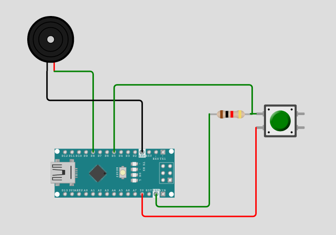

# MarsIT
<p align="center">
    
</p>

PackSafe представлява устройство, което следи за кражба на чанти/вещите в тях, с аларма и мобилно приложение с GPS проследяване.


## Как да си сваля и използвам проекта? (задължително)

### Инструкции за сваляне
    git clone https://github.com/filio123321/TuesFest2022.git

### Инструкции за инсталация
1) Front-end<br/>
```cd front-end/```<br/>
```npm install```<br/>
```npx expo start```<br/>
2) Embedded<br/>


    


## Използвани технологии 

* [Expo Go](http://expo.dev)
* [React Native](http://Reactnative.dev)
* [Arduino](https://www.arduino.cc/)
* [FirseBase](http://firebase.google.com)

## Информация за авторите на проекта

* **Филостратос Титопулос**(https://github.com/filio123321)
    * Software
* **Огнян Разсадов**(https://github.com/Footanari)
    * Software
* **Егени Попов**(https://github.com/nesumtepital)
    * Hardware
* **Александра Лазарова**(https://github.com/Ali1702)
    * Hardware
* **Михаил Петров**(https://github.com/MYNAMEISMGP)
    * Hardware


